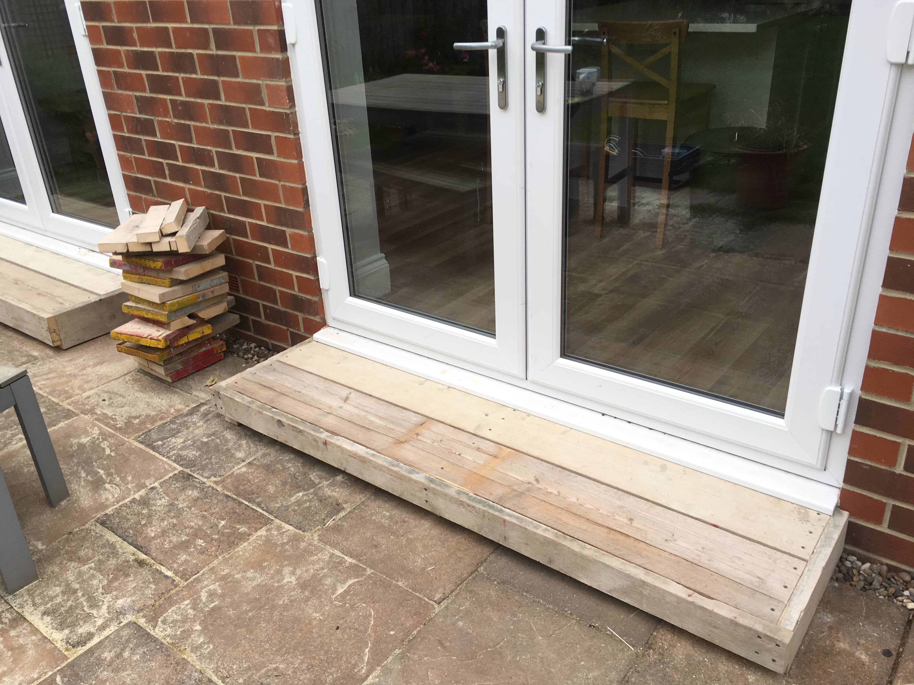

Scaffold board patio steps

# Scaffold board patio steps

A half-day project to build a pair of patio steps out of some recycled scaffolding boards from [Newcastle Wood Recycling CIC](https://www.welovewood.org/). Also known as we love wood. I would thoroughly recommend their products, ethos and sense of humour.

## Constraints

The steps had to -

* Accomodate the slope of the patio. This runs parallel to the back of the house to allow the rain to drain away.
* Be made from scaffolding boards. In all honesty, I was feeling hipster but I also figured they'd last a while outdoors.
* Last a while outdoors. Even though the boards were relatively cheap, I didn't want to be re-making them yearly. 
* Have the "right" depth. I wanted the step to be deep enough that you could easily put your foot on it, but not so deep that it required you to place both feet on it. That description is rubbish but hopefully it makes sense.
* Feel chunky. To match the aesthetic chunkiness of the scaffolding boards.

## Design

This is the design I came up with (I've no idea why I chose to take a photo of my laptop screen) -

You can just about see the construction in the image. There's 3 vertical supports which run front to back internally forming the feet you can see poking out the bottom. Each of these are cut to the right height to accomodate the slope. 

Forming the structure of the step, the horizontal boards lie on top of the feet. The boards around the outside are essentially cladding which also add a bit of rigidity. 

You can see my indecision in getting the depth "right". In the end, I laid the boards out in situ once I had them and tried walking on them. The 2 board design on the right just felt more "right" so I went with that.

## Final product

Unusually, it turned out pretty true to the design. The whole thing is held together with the liberal addition of 4x65mm decking screws.

|  |  |  |
| - | - | - |
| Steps and offcuts | More steps and offcuts with a hint of plate | Steps, offcuts, a plate with cake and a cup of tea! |

## What would I do differently?

Not a lot really. This is one of the very few projects that hasn't left any sense of instant or steadily accumulating regret. They've held up well for 2 years now and show no real signs of wear.

If I was nit-picking I'd say they're a little too tall, maybe by 5mm or so. That means that the slight movement in them can be enough if you step on them in the wrong way, to cause the plastic sills on the doors to creak.
