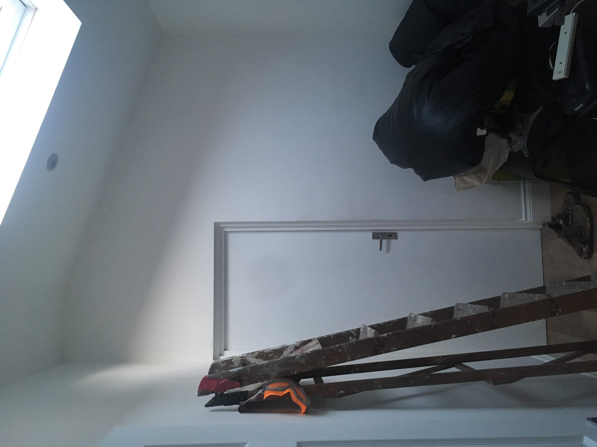
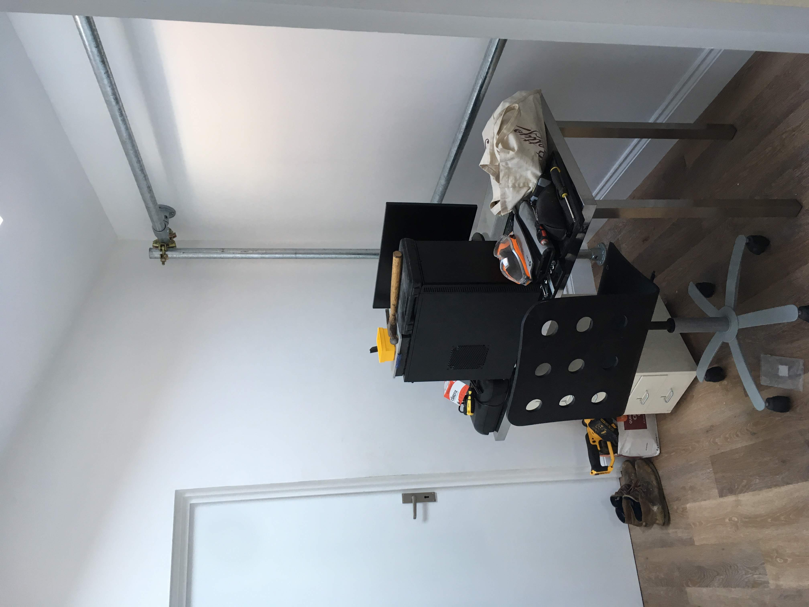
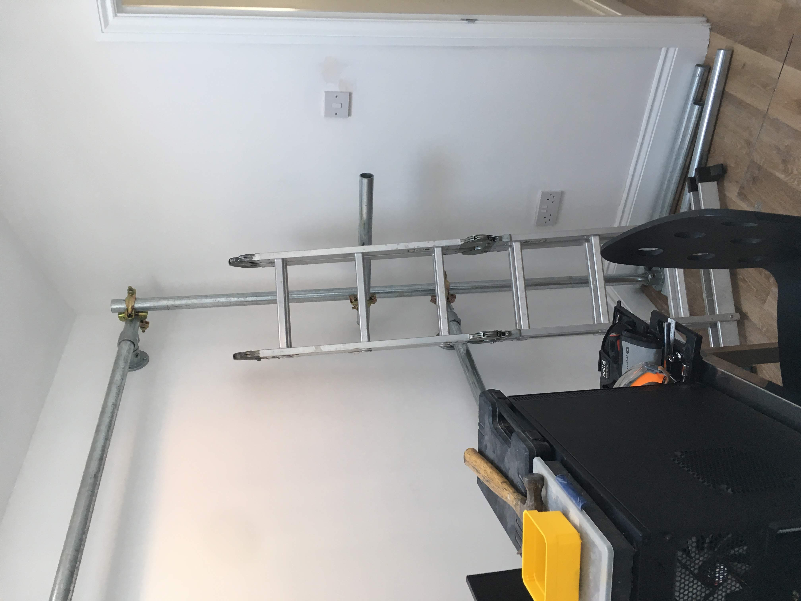
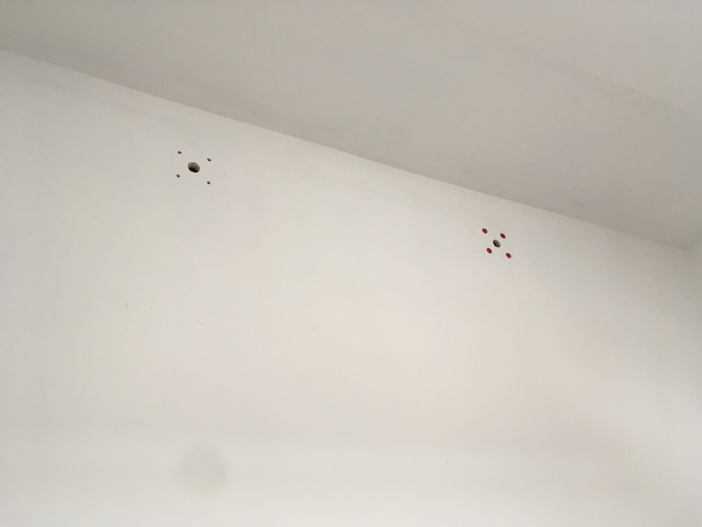
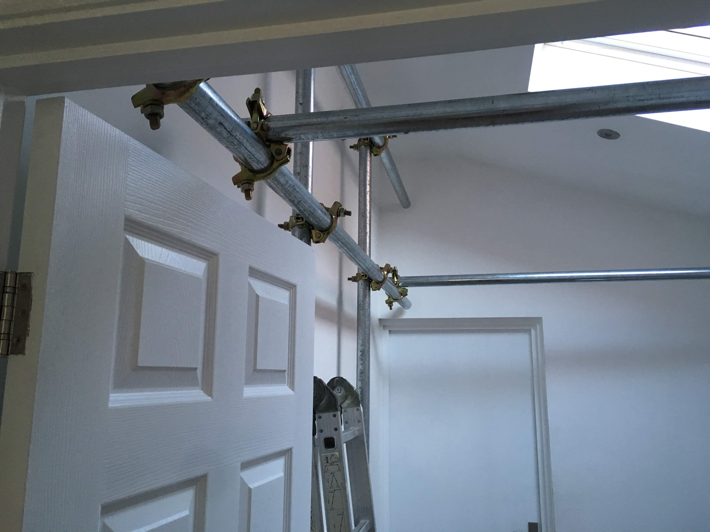
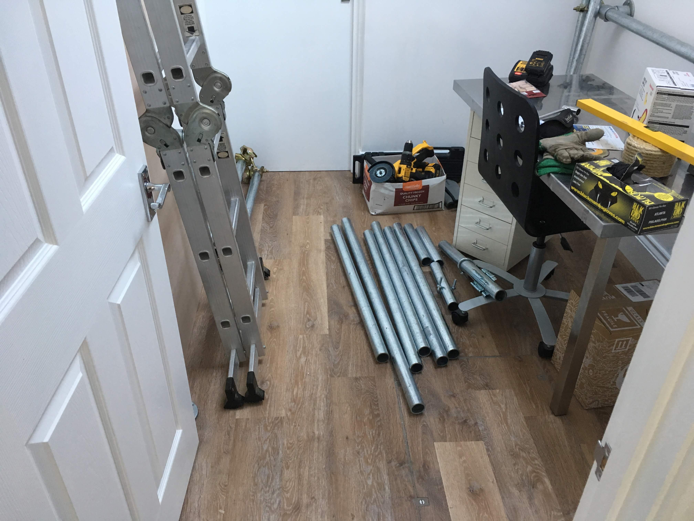

Framing a workshop with scaffolding

# Framing a workshop with scaffolding

A weekend build to decisively call shotgun on the new spare room before it was lost forever to less workshop-y purposes.

## Constraints

The design had to -

* Maximise the useable space in the oddly shaped room
* Minimise the damage to the brand new room
* Be flexible and adaptable; which led to...
* Be built out of scaffolding

## Design

The room itself is an odd shape, the consequence of being wedged down the side of our house. It's roughly 8.5ft x 6.5ft floor area, with a ceiling height of 8.5ft on one side and 6.5ft on the other. As you can see below, in the few weeks since the building work finished, it was already a dumping ground -

The idea with the scaffolding was that it was rugged enough to take whatever I threw at, or more accurately bolted to, it so I wouldn't ever have to worry about it being able to take the weight of anything. There was also the whole minor side benefit of it justifying the purchase of an angle grinder.

I went through many iterations of design in Sketchup without being able to find anything I really liked the look of. I'd almost settled on a design in which most of the furniture in the room was made of scaffolding poles and then I priced it up... It was at that point that I decided I would buy the somewhat smaller quantity of scaffolding my budget could accomodate and work backwards from that when it arrived.

## Final product

The poles were measured, marked with a Sharpie using one of the fittings as a guide, then cut to size with a cutting disk and a great deal of care. Finally, they are held in place using fittings bolted to the timber wall with coach bolts -

|  |  |
| - | - |
| Short wall left | Short wall right |

For the opposite wall, the fixings were a bit more involved. It's a brick wall with dot and dab plasterboard over the top. Attaching anything of weight using plasterboard fixings would pull holes in the plasterboard. Conversely putting anchors directly in to the brick would collapse the plasterboard. Luckily, this isn't an original problem and these [Corefix fixings](https://www.amazon.co.uk/gp/product/B072JYXJL6) did the job.

|  |  |
| - | - |
| Dot and dab fixings | Tall wall and cross braces |

If you're curious as to why there's a large hole in the middle of each cluster of four, that was me being overly cautious and drilling an inspection hole. I knew there were power cables in the rough vacinity and I was minded to not drill into them.

Finally, I added some more poles between the two walls as cross bracing. By this point my thinking was to build a frame to allow me to attach stuff to the walls, add some shelves to make use of the space above head height and leave the floor clear for some wheeled benches. This didn't actually turn out to be the final design but this post is already long enough and I haven't even covered my mistakes yet, so I'll leave it there for now.

## What would I do differently?

Surprising noone, I should have spent the time designing it properly and then ordering pieces pre-cut to the right size. Whilst playing with the cutting wheel on angle grinder was initially fun, if a bit terrifying, it took a while to cut through and cutting a lot of poles got old quickly. I also found it really quite hard (read impossible) to get a square cut and over time the cut edges have rusted because there's no galvanic treatment where they've been cut.

 

On the flip side flap discs are much less terrifying to use, still generate a satisfying amounts of sparks to impress the neighbours and make short work of tidying up rough edges. A much more recent discovery which goes even further in covering up my crimes are [plastic end caps](https://www.scaffolding-direct.co.uk/plastic-stop-end-133-d-48-3mm-.aspx).

I used [wall flanges](https://www.scaffolding-direct.co.uk/wall-flange-131d-48-3mm-.aspx) under the base of the poles to spread the weight of the as much as possible. On reflection I should totally have just used [base plates](https://www.scaffolding-direct.co.uk/base-plate-132-d-48-3mm-.aspx) which are designed for the job. I was originally put off using them because of the slightly smaller base area. However, after battling to get the pole as close to the wall as possible, I realised the more rectangular shape is to allow the poles to sit closer to the wall.

The fixings were generally an area where I'd gone for hipster aesthetics over practicality -

* [Tube clamps](https://www.scaffolding-direct.co.uk/tube-clamps-48-3mm/) definitely look the slickest but they're a nightmare to work with because you have to slot them over the end of the pole. That means you can't fix the pole in place at its ends and then add a clamp in the middle without unfixing one of the ends first. I like to work "organically" and my designs tend to "evolve" (read I don't do enough preparation and make a lot of mistakes), so using tube clamps led to a lot of unnecessary rebuilding. They're also not as strong as the other fixings but they do have the lowest profile.

* [Pressed double couplers](https://www.scaffolding-direct.co.uk/scaffolding-fittings-pressed-steel-double-coupler-25-.aspx) are a significant improvement. Each half of the clamp opens up which means you're free to add them to a pole anywhere along its length, without having to slide them on from an end. In my case though I still found that sometimes they were a bit awkward to use as there wasn't enough clearence to get a socket in to tighten them so I had to resort to a spanner held at an awkward angle.

* [Pressed single couplers](https://www.scaffolding-direct.co.uk/scaffolding-fittings-pressed-steel-single-coupler-25-.aspx) would probably be my go to solution if I was starting again. They have the advantage of opening on both sides so you can freely add them to a pole which is already fixed in place, and they only require tightening from the one side so you can always get a socket in to tighten them. If I had to guess I'd say they're probably a half-way house between the other two in terms of strength but for what I'm using them for, I think using any of them would have been fine.

Despite there being a lot I'd change if I started again, I am still happy with the result. It continues to serve its purpose well as a frame to support everything bolted to it. Most recently this has been its conversion into an impromptu office, it is quick and incredibly satisfying to fashion an improtu monitor support positioned eactly where you want it in space. Maybe all offices will look like this in the future?!

