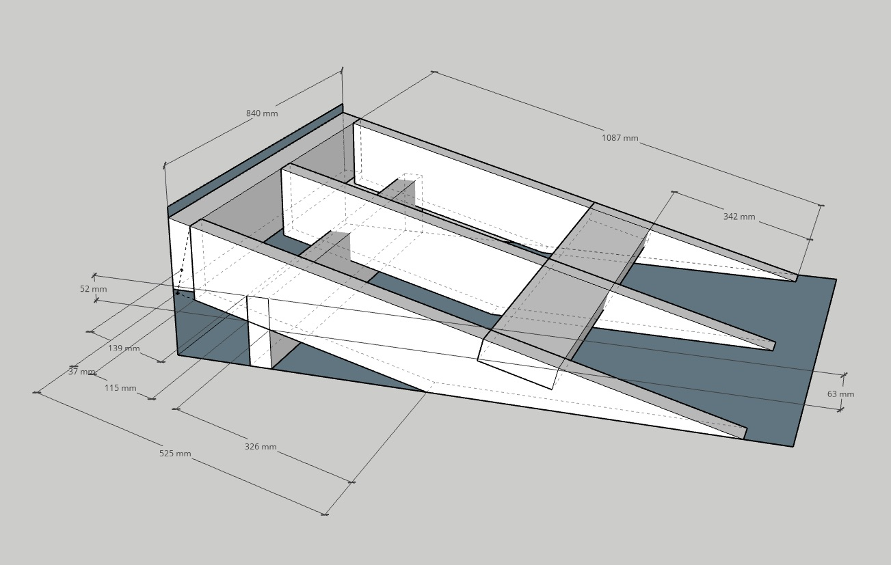
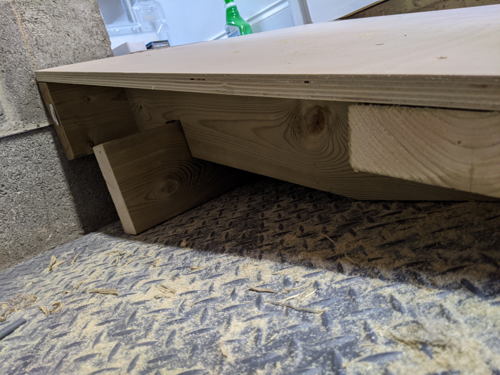
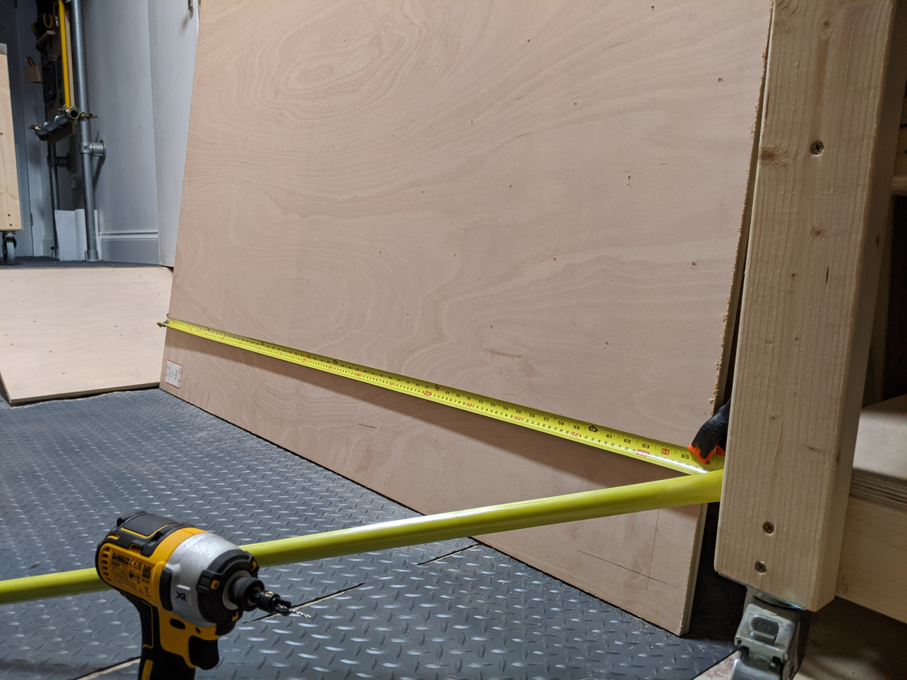

Garage ramp

# Garage ramp

This was the first of 3 projects I attempted during my first weeks "holiday" of the Covid-19 lockdown. It was in no way influenced by having to lug an old washing machine down the previous steps and then the new one back up them.

## Constraints

As always I'd drempt us some constraints to shape my ideas -

* I was buying 18mm plywood and 3600x45x150mm timber (12ft 2x6s) for the other projects, so I stuck with those as materials.
* I hadn't originally expected to build the ramp when I ordered the wood (see the above comment about the washing machine) so I had to limit myself to a single piece of timber to leave enough for the other projects.
* I was keen that there wasn't a lip onto the internal floor level because I suspected the flooring on the corner, if it was exposed, wouldn't stand up well to punishment.
* The workbenches in the workshop are on wheels so it made sense to ensure that the angles were such that the benches could easily be moved up and down the ramp.
* It was also important that it was as wide as the door and sturdy to accomodate large objects like... I don't know... washing machines.

## Design

I went to town with the Sketchup drawing for this one because I wanted to make sure I got all the measurements/angles right, such that the ramp lined up perfectly with the internal floor height. I wasn't sure exactly how I was going to cut it out so I annotated anything with a straight edge to avoid having to do maths later -

Looking back at the design now there are some obvious mistakes but we'll come back to them!

## Final product

I'm pretty sure the whole frame was cut to size and shape with a circular saw. The notching was done with repeated parallel cuts and finished off with some blunt chisel action. The surface was likewise cut with the circular saw, with a rough approximation of the extremely shallow angle onto the garage floor. Luckily it didn't need to be pretty! 

|  |  |  |
| - | - | - |
| Assembled top view before being fixed to the wall | Assembled side view before being fixed to the wall | In situ view with some sneak peaks of other projects |

Where possible the ramp is held together with 5x80mm woodscrews and where I'd not given any thought as to how it was going to be held together, I had to use some insanely long 6x150mm screws I had lying around. Finally the frame was held to the concrete block wall with some 7.5x100mm concrete screws.

## What would I do differently?

Quite a lot with this one, although I am happy with the end result. It's taken everything I've thrown at it so far and it still feels solid. However, I do have some niggling regrets about how I built it. The frame looked the part in Sketchup but had some obvious flaws when I came to make it. 

Notching the 3 main sloped pieces to accept the horizontal support was a lot of effort versus notching just the middle and butting the against the sides. I could possibly even have gotten away with just using noggins as the surface and the liberal use of screws would have held everything together. Despite the extra effort, notching the wood didn't leave much behind so I had to be quite careful not to snap the supports before the surface was attached.

If those notches were bad, the others were so much worse. Perpendicular notches are relatively straightforward but these were not only at an angle, they also had asymetric walls. That meant spending way more time than I'd like to admit adjusting the depth stop on the saw, doing another parallel cut, finding I'd over/undershot the line and then repeating before breaking out the (still blunt) chisel. 

All of this effort to accomodate the rectangular piece of supporting timber. Thinking to myself the entire time that there must be an easier way to do it, all the while staring at the piece of timber I'd just cut with a mitre along its long edge. If I'd just cut another piece of wood with the exact same mitre, turned it upside down and used **it** as the support, I could just have cut a nice easy square notch and been done with it.

