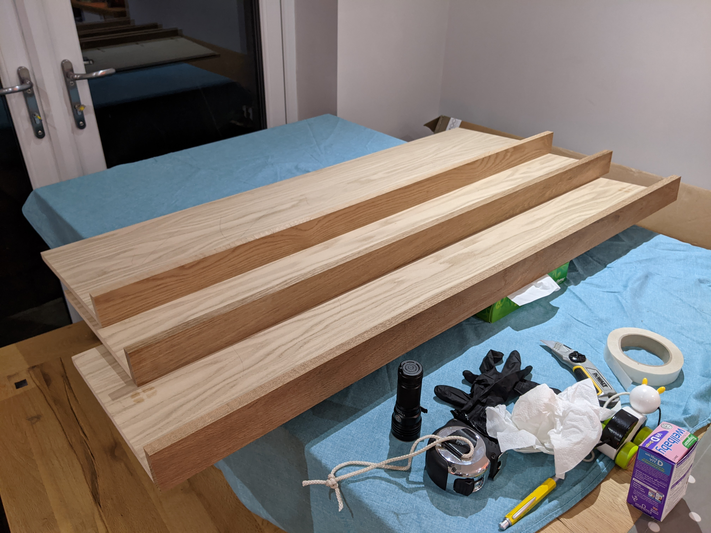
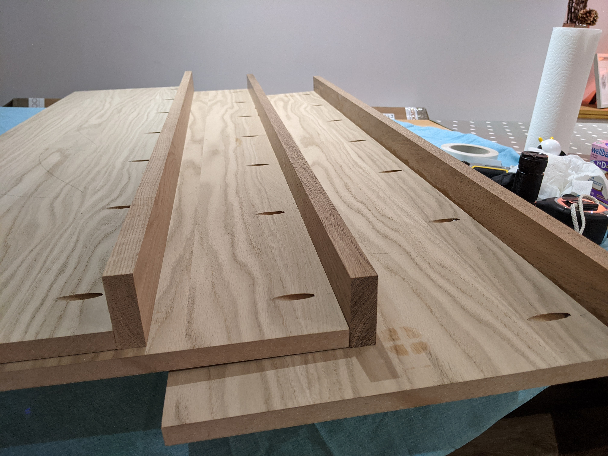
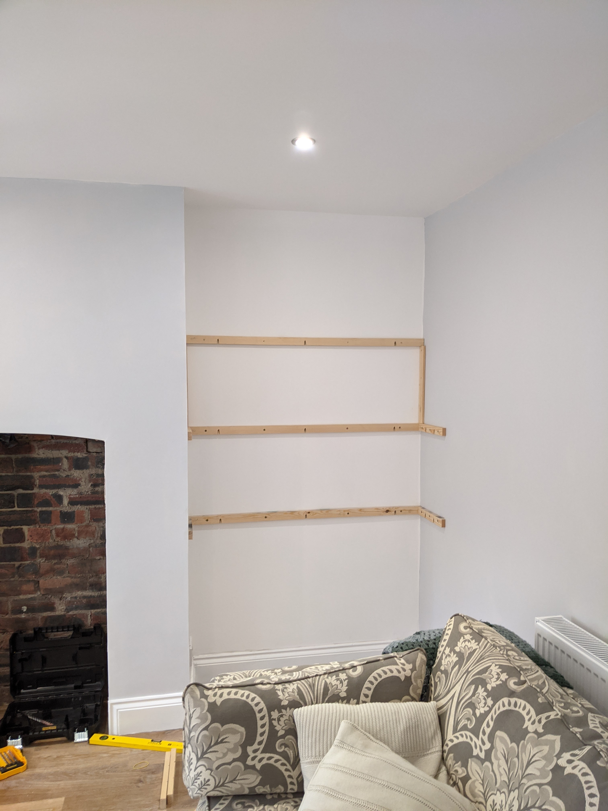
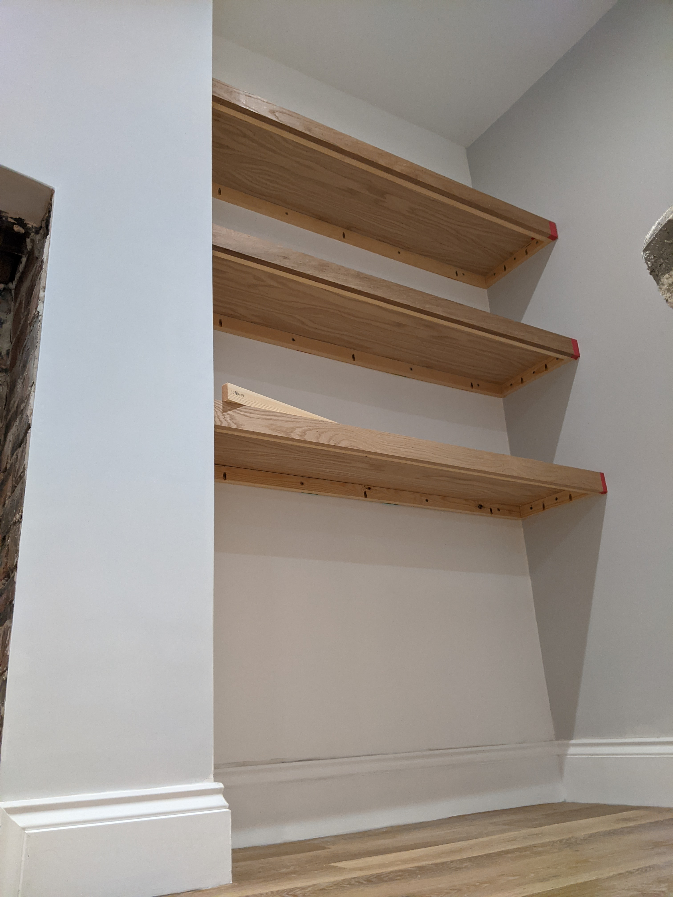

Kitchen Shelves

# Kitchen Shelves

In a twist to writing up projects months/years after I've completed them, today I thought I'd share a work in progress. Last weekend, I set about putting some shelves up in an alcove of our kitchen.

## Constraints

As this was a "commissioned" project, the client brief was to -

* Make 3 floating shelves spanning the width of the alcove. The lowest shelf had to high enough to allow a toy chest to open fully under it and all of the shelves had to fit 30cm high boxes.
* Match the style of the existing kitchen table, which has a chunky 6cm solid oak top (at least that's what it looks like from the side, it rapidly swaps chunky wood for metal bracing beyond its perimeter).
* Keep the materials cost down. Whilst 6cm solid oak shelves would definitely do the job, they'd also be way over budget.
* Keep the shipping cost down. I tend to order wood for projects which require a nice finish from [Woodshop Direct](https://www.woodshopdirect.co.uk/). They have a shipping price break around 32kg (it might actually be volume based) so there's a bit of an art to sticking under that.

## Design

This one never made it as far as Sketchup but I had a pretty solid idea in my head of what I was going to do. 

Taking inspiration from the table's frugal use of wood, the front of the shelves would be a solid strip of timber 6cm tall but only 2cm deep. The top of the shelf would be laminated 16mm MDF, when combined with the front strip this [online calculator](https://www.woodbin.com/calcs/sagulator/) reckoned it should be more than enough to prevent any sag. The bottom would be the thinnest laminate I could get which was 3.6mm plywood.

Internally, there would be a cheap and simple pine timber frame sized to fill the void between the top and the bottom (4cm). It would be attached to the wall on 3 sides with the front and top sat on... top.

I didn't give too much consideration to how all the pieces would be joined together. I figured as there was a face side and a hidden side to each piece, there was plenty of scope for the liberal application of glue and pocket screws.

## Final product - so far

First order of business attaching the shelf tops to the fronts. I wanted these to be joined before I cut them so their lengths matched exactly. That way I give the illusion of them being a single piece the best chance possible.

I started by drilling pocket holes in the underside of the shelf tops. As the oak timber fronts were already starting to bow, I opted to use a decent number of screws along with some excessive clamping to bring everything back square.

|  |  |
| - | - |
| Top and front pocket screwed and glued, plus some clues as to what all the new storage is for! | Side view of the top/fronts showing the pocket holes |

Next up was cutting the timber frame down to the right sizes on the mitre saw. Then drilling holes for the wall mounting screws and more pocket holes (possibly too many given it'll also be glued) to allow attaching the top without leaving screw holes on the outside of the shelf. 

Using the holes in the frame as a guide, I drilled through them and into the plaster to mark exactly where the holes in the wall needed to be. This approach ensures the holes will match up and avoids any problems from not drilling the holes in the frame straight. The SDS drill then made short work of drilling the 8mm holes in the wall for the fischer SX 8x40 plugs. 

Finally, it was time for cutting the shelves to the right size on the mitre saw, for the very not square walls. As this cut was going to be visible on the surface of the shelves, I covered where I was going to cut with masking tape to lessen the tear out. The shelves were just too deep for the length of cut on the saw, so I cut 2/3 of the way then flipped them over for the last 1/3. Again as the cut was going to be visible, I made sure to cut through the front 2/3 so that the join would be slightly further away from anyone inspecting my work.

|  |  |
| - | - |
| Most of the framing attached to the wall, note the spacer | Bottom view of a dry-fit of the shelves |

I've somewhat skipped over the multiple iterations of measure the space, cut the shelf, attempt to fit the shelf, swear, re-measure the space, etc. etc.. There was also more plaster gouging than I'd care to admit but nothing a little filler and paint won't fix.

## What would I do differently?

Even though I ran out of time, I'm already pretty happy with how they look (despite the collateral damage to the plaster). I'm still aware that I could have made my life a bit easier in a few areas -

* 0.4mm does not leave much margin for error. That's the 60mm front minus the 16mm top, the 40mm frame and the 3.6mm bottom. Not only is that not a lot of wiggle room for lining things up when attaching the front and the top, but it also robs you of any ability to shim between the shelf and the frame. That means your frame has to be perfectly level (see next bullet) when it's attached to the wall. 
* Marking a straight line around non-square corners on a non-level floor is really hard without a laser level. I got reasonably close but I knew that there was little chance of the other shelves matching. So I opted to cut a pair of spaces from some scrap timber and use these to space out the location of the next shelf. This ended up working great at ensuring a consistent level of unlevelness, but it would definitely have been better to start with a level line on the first shelf.
* Drill deeper. I don't know why but every time I drill into a wall to put a plug in, I drill the hole to the "right" depth, start pushing the plug in and find it won't go all the way in. I assume the hole ends up shorter than the depth stop says it should be because of all the detritus left in the hole, or maybe I'm not accurately setting the depth stop. Regardless, I need to learn to set the depth stop a 30mm deeper than I think I need it.

I'm optimistic that I've broken the back of this project but I have a habit of underestimating how much time finishing can take. Luckily it seems [I won't have anything fun to distract me any time soon](https://www.bbc.co.uk/news/uk-54763956)...